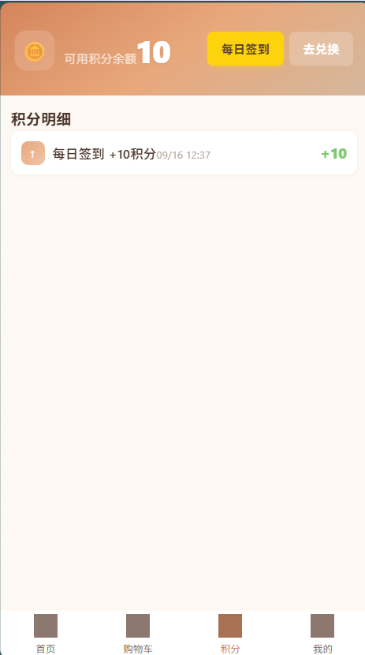

# 味遇 · 积分点餐系统

一套给小型圈子用的积分制点餐系统。管理员发积分，顾客用积分点菜，没有真实支付，适合朋友、同事、社团内部用。

**在线演示**：TODO — 等部署了再填

---

## 预览

| 首页 | 购物车 | 管理员接单 |
|------|--------|-----------|
|  |  |  |

> 截图还没截，先占位。跑起来自己看也行。

---

## 快速开始

### 环境要求

- Node.js ≥ 18
- MySQL 8.0+
- HBuilderX（uni-app 前端）或 VSCode + 插件

### 1. 数据库

```bash
# 登录 MySQL，执行初始化脚本
mysql -u root -p < server/database.sql
```

### 2. 后端

```bash
cd server
cp .env.example .env
# 编辑 .env，填上你的数据库密码

npm install
npm run start:dev
```

后端默认跑在 `http://localhost:3000`，API 前缀 `/v1`。

### 3. 前端

用 HBuilderX 打开 `12/` 目录：

- **H5**：运行 → 运行到浏览器
- **微信小程序**：运行 → 运行到小程序模拟器

前端默认连 `localhost:3000`。如需内网穿透给手机测试，改 `12/utils/config.js` 里的 `ENV` 为 `tunnel` 并填上穿透地址。

---

## 技术栈

| | 技术 |
|--|------|
| 前端 | uni-app (Vue 3) |
| 后端 | NestJS + TypeORM |
| 数据库 | MySQL 8.0 |
| 实时通知 | WebSocket |

---

## 默认账号

部署后数据库里自带 5 个管理员账号：

| 账号 | 密码 |
|------|------|
| admin1 ~ admin5 | 123456 |

**部署后务必修改默认密码。**

顾客端首次用"账号+密码+口令"登录即自动注册，口令就是管理员的 `group_code`。

---

## 项目结构

```
.
├── 12/                  # uni-app 前端
│   ├── pages/           # 页面
│   ├── components/      # 组件
│   ├── api/             # 接口封装
│   ├── store/           # 状态管理
│   └── utils/           # 工具函数
├── server/              # NestJS 后端
│   ├── src/
│   │   ├── entities/    # 实体
│   │   ├── modules/     # 业务模块
│   │   └── common/      # 守卫/拦截器/过滤器
│   └── database.sql     # 数据库初始化
└── docs/                # 文档
```

---

## TODO / 已知问题

- [ ] 微信小程序登录目前没接真接口（需要企业资质）
- [ ] 文件存储目前本地存储，量大后需上云
- [ ] 缺少单元测试（后面补）
- [ ] 管理后台 UI 在低端机上可能有点卡

---

## License

MIT
